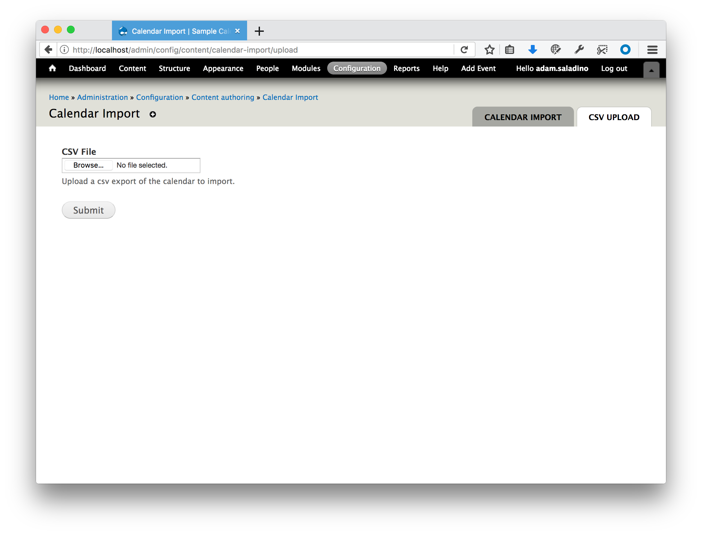
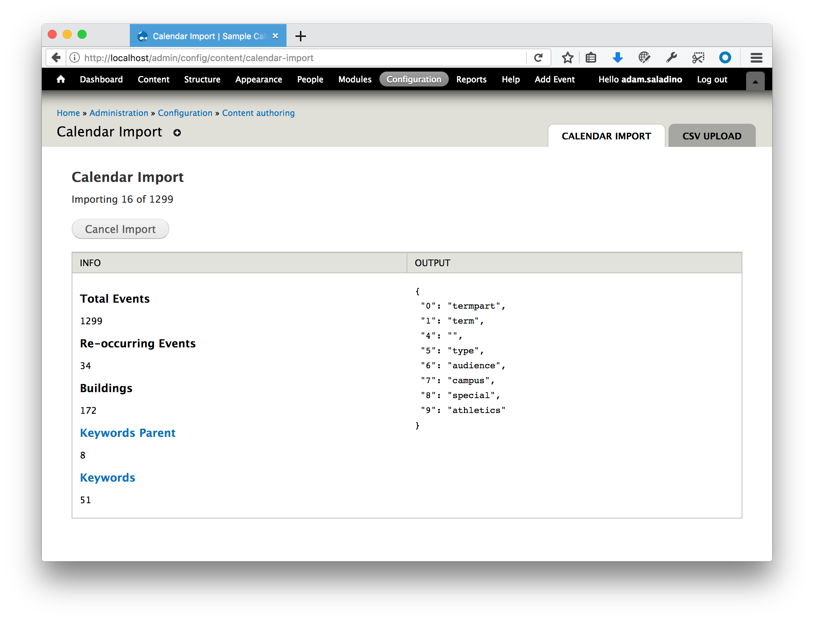

# Event Calendar Importer

This is a Drupal 7 module that will import calendar 
events from a csv file. This is module is very specific and 
will not work with other calendar implementations but should be 
a good reference to construct other importers.

## Upload

Upload the csv file that you would like to import.

## Import

The import view is crude but gets the job done.

